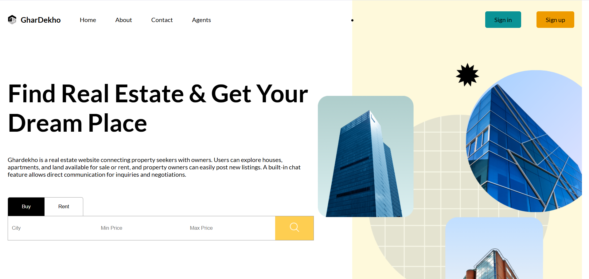
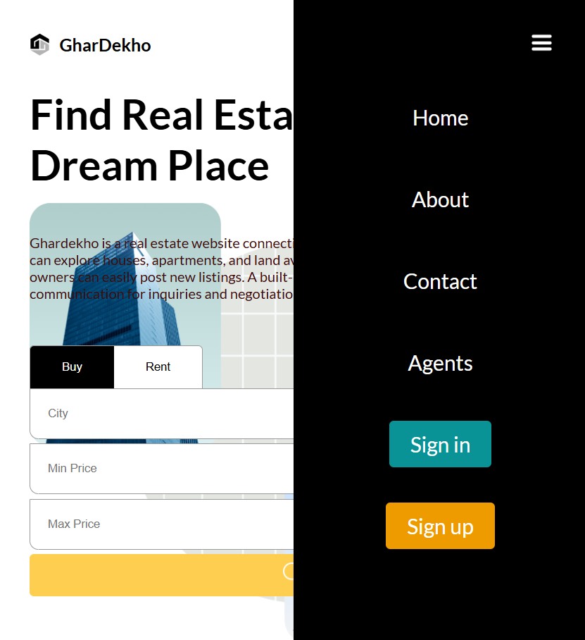
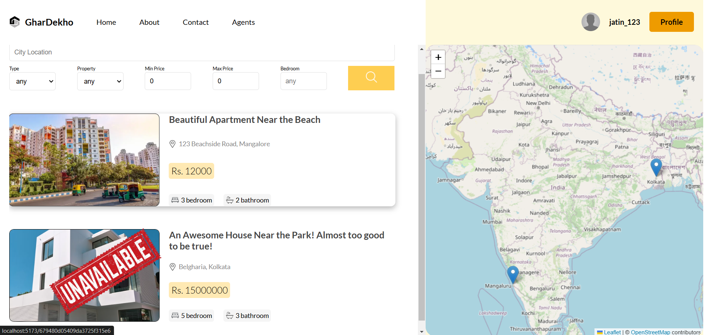
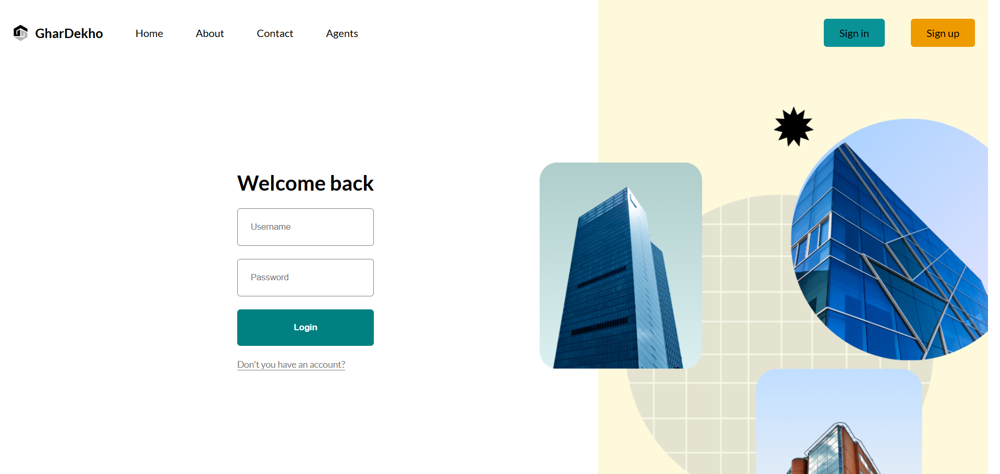
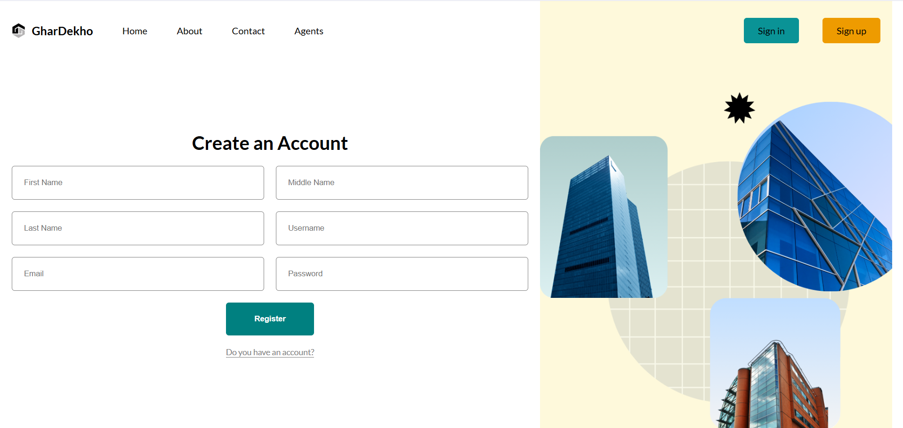
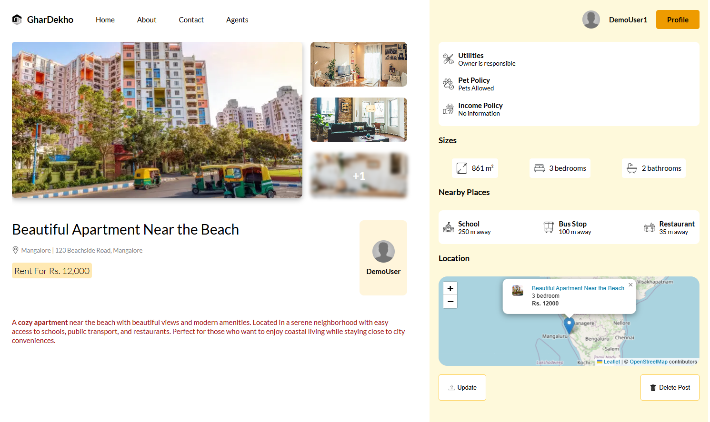
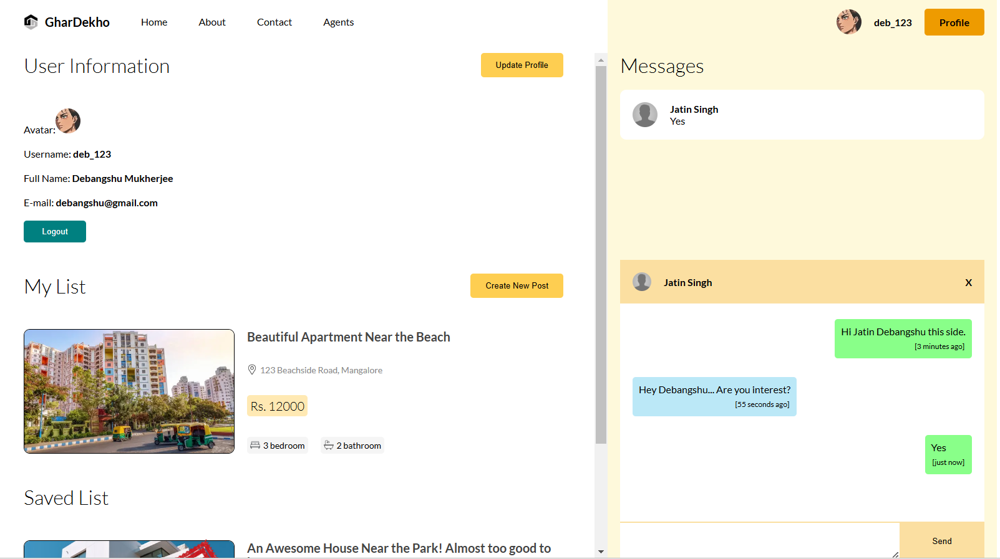
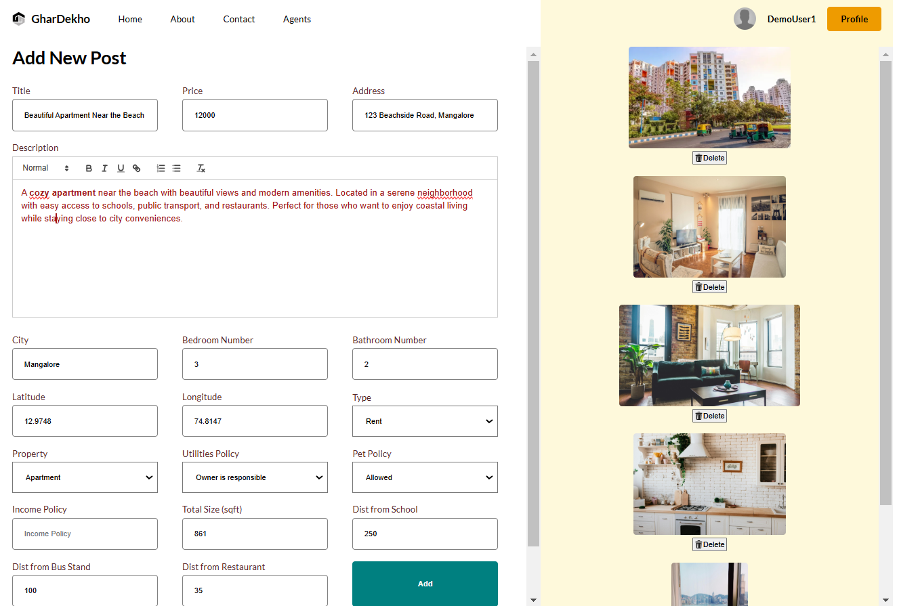

# GharDekho: Real Estate Buy & Sell Platform

---

## **Table of Contents**

1. [Overview](#overview)
2. [Features](#features)
3. [Tech Stack](#tech-stack)
4. [Installation and Setup](#installation-and-setup)
    - [Clone the Repository](#1-clone-the-repository)
    - [Setup the Client](#2-setup-the-client)
    - [Setup the API](#3-setup-the-api)
    - [Setup the Socket Server](#4-setup-the-socket-server)
    - [Run the Application](#5-run-the-application)
    - [Run All Servers](#run-all-servers)
5. [Usage Scenarios](#usage-scenarios)
6. [Screenshots](#screenshots)

---

## **Overview**

**GharDekho** is a user-friendly online platform designed to simplify real estate transactions. It connects property buyers, sellers, and renters in an efficient, transparent, and secure manner. The platform provides robust tools to list, search, and manage properties, along with real-time messaging for seamless communication.

---

## **Features**

- **Property Listings**: Browse and search properties based on location, price, type, and other filters.
- **User Profiles**: Create and manage personalized profiles for buyers and sellers.
- **Property Management**:  
  - Sellers can list, update, and manage their property posts.  
  - Buyers can save properties for later viewing.
- **Search and Filters**: Advanced filters for precise property searches.
- **Real-Time Messaging**: Direct communication between buyers and sellers.
- **Interactive Maps**: View property locations and nearby amenities using an intuitive map interface.

---

## **Tech Stack**

- **Frontend**: React.js
- **Backend**: Node.js, Express.js
- **Database**: MongoDB
- **Real-Time Communication**: Socket.io
- **Maps Integration**: React-Leaflet with Leaflet.js

---

## **Installation and Setup**

Follow these steps to set up the project locally:

### **1. Clone the Repository**

```bash
(https://github.com/js-jatinsingh/ghar-dekho.git)
cd GharDekho
```

### **2. Setup the Client**

```bash
cd client
npm i
npm i react
npm i sass
npm i react-leaflet leaflet
npm i dompurify
npm i timeago.js
npm i react-router-dom
npm i react-quill
npm i axios
npm i socket.io-client
npm i zustand
```

### **3. Setup the API**

```bash
cd ../api
npm init -y
npm i express
npm i nodemon
npm i bcrypt
npm i prisma
npm i @prisma/client
npm i cookie-parser
npm i jsonwebtoken
npm i cors
npx prisma init --datasource-provider mongodb
npx prisma db push
```

**Note**: If you want, change the database URL in the `.env` file with your database link.

### **4. Setup the Socket Server**

```bash
cd ../socket
npm init -y
npm i nodemon
npm i socket.io
```

### **5. Run the Application**

- **Start the client:**
  ```bash
  cd client
  npm run dev
  ```

- **Start the API server:**
  ```bash
  cd ../api
  nodemon app.js
  ```

- **Start the Socket server:**
  ```bash
  cd ../socket
  nodemon app.js
  ```

## **Run All Servers**
Alternatively, you can automate the process by executing the `start.sh` file, which will start all three servers:
```bash
sh start.sh
```

---

## **Usage Scenarios**

1. **Property Search**: Buyers can use filters to find properties that match their criteria (e.g., budget, type, location).
2. **Property Listing**: Sellers can create posts with details such as property type, price, images, and location.
3. **Communication**: Users can exchange messages in real-time to negotiate or inquire about listings.

---

## **Screenshots**

- **Home Page (Before Sign-In)**: Overview of the platform and features.  
  


  
- **Home Page (Small Screen)**: Overview of the platform and features.  
  


  
- **Home Page (Small Screen with Menu option open)**: Overview of the platform and features.  
  


- **Search Page (Before Sign-In)**: Search properties using filters.  
  


- **Sign-In Page**: User authentication interfaces.  
  


  
- **Sign-Up Page**: User authentication interfaces.  
 


- **Property Details Page**: Detailed view of a single property with options to save or contact the seller.  
  


- **Profile Page**: Manage saved listings, posted properties, and user details.  
  

  
- **Add Post Page**: Adding a new Post about house/apartment/land.  
  


---
